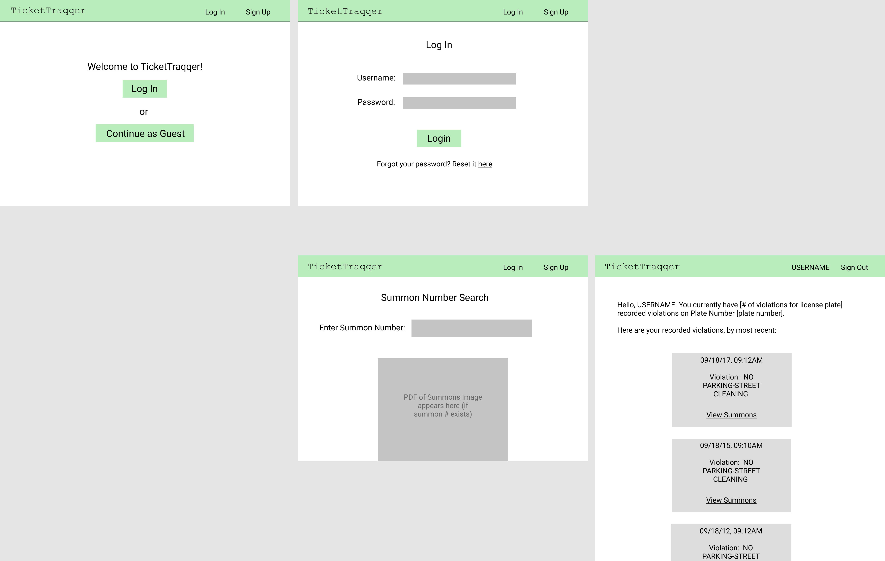

# Final Project (TicketTraqqer)

## Purpose/Goal
TicketTraqqer is a web application aimed at helping users view their driving violations via Open Parking and Camera Violations, which is a dataset that contains all violations contained in the NYC OpenData mainframe database since May 2016.

Without an account, one can search for a violation based on their summons number. If the summons number is within the dataset, a pdf containing summon and violation will be returned. If the user wishes to track all the violations they've made under a single license plate, they must create an account, providing a unique username, password, and license plate number. If all information is unique and valid, the user's account is created and they're guided to a page that displays all of their license plate's recorded violations.

## Languages/Frameworks Used
1. React (frontend)
2. MySQL (backend/database)
3. Express (backend/server)
4. HTML/CSS (frontend)
5. Open Parking and Camera Violations (API)

## Duties:
- __Bryan Marchena__:
- __Emmanuel Vargas-Zapata__: 
    - Creating the App component on App.js
- __Andrew Ohakam__: 
    - Designing website wireframes (see below)
    - general stylization (sign-up sheet, navbar and footer fixes)
    - Creating Sign-Up component

## Wireframes (Website draft)

