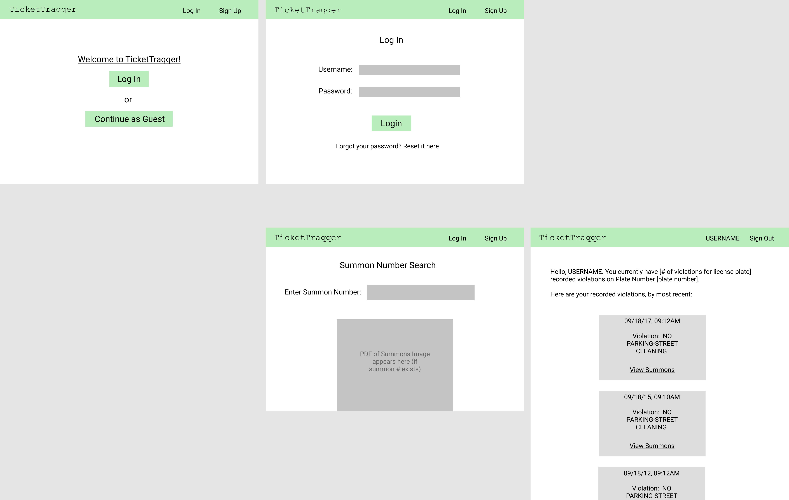

# Final Project (TicketTraqqer)

## Purpose/Goal
TicketTraqqer is a web application aimed at helping users view their driving violations via Open Parking and Camera Violations, which is a dataset that contains all violations contained in the NYC OpenData mainframe database since May 2016.

## Languages/Frameworks Used
1. React (frontend)
2. MySQL (backend/database)
3. HTML/CSS (frontend)
4. Open Parking and Camera Violations (API)

## Duties:
- __Bryan Marchena__:
- __Emmanuel Vargas__: 
- __Andrew Ohakam__: 
    - Designing website wireframes (see below)
    - general stylization (for sign-up sheet, navigation bar)
    - Developing Sign-Up sheet

## Wireframes (Website draft)

